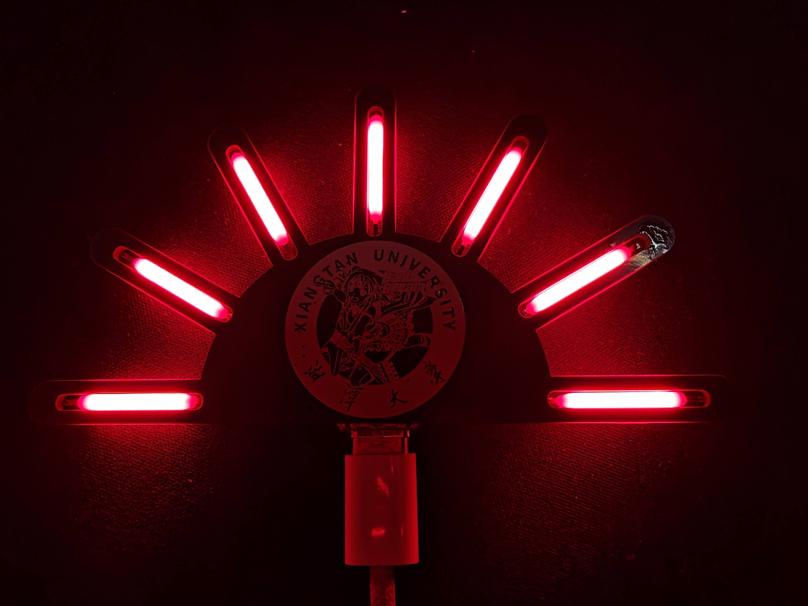

# Peacock

<p align="center">
  
</p>

<p align="center">
  <a href="https://space.bilibili.com/3546647883680530"></a>
  
  
  
  
</p>

<p align="center">小孔雀 V4.0，恩师 <a href="https://space.bilibili.com/3546647883680530">ずっと徹夜中でいい</a></p>

> STM32G030xx 项目，基于 STM32CubeMX 生成，使用 CMake 构建，7 路 LED 高速调光。

## 目录

- [项目简介](#项目简介)
- [功能列表](#功能列表)
- [高频调光说明](#高频调光说明)
- [环境与依赖](#环境与依赖)
- [快速开始](#快速开始)
- [模式与参数](#模式与参数)
- [目录结构](#目录结构)
- [重新生成 CubeMX 代码](#重新生成-cubemx-代码)
- [常见问题](#常见问题)

## 项目简介

Peacock 是基于 STM32G030 的 7 路 LED 灯效控制工程，支持多模式灯效、按键交互与参数保存。工程采用高频调光方案降低可见闪烁与相机滚动条纹。

## 功能列表

- 7 路 LED 软件调光，GPIOA BSRR 原子更新
- 9 种灯效（流动/呼吸/爆闪/常亮/全灯呼吸）
- 伽马校正 + 双缓冲帧切换，避免撕裂
- 按键消抖，短按切换模式，长按进入设置
- 参数档位调节与 Flash 持久化

## 高频调光说明

- **目标 PWM 基频**：20 kHz（每路 LED 的调光周期）
- **调光实现**：BAM（Bit Angle Modulation）+ 相位表预计算
- **中断更新率**：约 120 kHz（6 bit 位平面，帧内按位更新）
- **抖动处理**：跨帧误差分配，将 8-bit 亮度映射到 6-bit BAM
- **帧边界切换**：仅在帧边界交换双缓冲相位表，避免中途变化导致闪烁

提示：若 LED 边沿过缓，可在 `MX_GPIO_Init` 中将 GPIO_SPEED 调高到 MEDIUM。

## 环境与依赖

| 组件 | 说明 | 备注 |
| --- | --- | --- |
| CMake | 3.22+ | 配置生成 |
| Ninja | 构建器 | 推荐 |
| ARM GNU Toolchain | `arm-none-eabi-gcc` | 需在 PATH 中 |
| STM32CubeMX | 可选 | 重新生成代码 |

## 快速开始

### 1. 配置与编译（Debug）

```sh
cmake --preset Debug
cmake --build --preset Debug
```

### 2. Release 构建

```sh
cmake --preset Release
cmake --build --preset Release
```

### 3. 清理构建产物

```sh
cmake --build --preset Debug --target clean
```

### 4. 构建产物

- `build/Debug/peacock.elf`
- `build/Debug/peacock.map`

## 模式与参数

| 模式 | 灯效描述 | 参数含义 |
| --- | --- | --- |
| 1 | 正向单灯流动 | 流动速度 |
| 2 | 反向单灯流动 | 流动速度 |
| 3 | 中心向两侧分组流动 | 流动速度 |
| 4 | 呼吸流动（软亮环绕） | 流动速度 |
| 5 | 反向呼吸流动 | 流动速度 |
| 6 | 中心向外分组呼吸 | 流动速度 |
| 7 | 全亮/全灭爆闪 | 爆闪周期 |
| 8 | 常亮 | 亮度 |
| 9 | 全灯呼吸 | 呼吸速度 |

### 参数档位与具体数值

参数档位范围为 1~7，档位越大变化越快/更亮。

| 档位 | 流动周期 (ms) | 爆闪周期 (ms) | 常亮亮度 (0~255) | 呼吸速度 (ms) |
| --- | --- | --- | --- | --- |
| 1 | 240 | 300 | 20 | 6010 |
| 2 | 200 | 240 | 36 | 5330 |
| 3 | 160 | 200 | 56 | 4660 |
| 4 | 130 | 160 | 80 | 4000 |
| 5 | 110 | 130 | 110 | 3330 |
| 6 | 90 | 110 | 160 | 2660 |
| 7 | 70 | 90 | 220 | 2000 |

说明：
- 模式 1~6 使用“流动周期”作为速度参数
- 模式 7 使用“爆闪周期”
- 模式 8 使用“常亮亮度”
- 模式 9 使用“呼吸速度”
- 呼吸周期为全灯由暗到亮再到暗的一次完整周期，表中为近似值

按键为低电平有效（上拉输入）：
- 短按：切换灯效模式
- 长按：进入/退出设置模式
- 设置模式下短按：切换当前模式的参数档位

### 设置模式与参数保存

进入设置模式后，当前档位会以单灯高亮方式提示（第 1到7 颗灯对应档位 1到7）。
退出设置模式后，参数会延迟写入 Flash，避免频繁擦写。

## 构建模式说明

| 模式 | 目标 | 主要差异 | 适用场景 |
| --- | --- | --- | --- |
| Debug | 调试优先 | `-O0 -g3` | 断点调试、问题定位 |
| Release | 体积/性能优先 | `-Os -g0` | 量产固件、尺寸敏感 |

说明：
- 模式由 CMake preset 控制，定义在 `CMakePresets.json`
- 具体编译参数在 `cmake/gcc-arm-none-eabi.cmake` 统一设置

## 目录结构

```
peacock/
├── Core/                    # 应用代码 (main, ISR, system)
├── Drivers/                 # CMSIS 与 HAL 驱动
├── cmake/                   # 工具链与 CubeMX CMake 集成
├── Hardware/                # 立创EDAPro工程文件以及交互式BOM
├── startup_stm32g030xx.s    # 启动文件
├── STM32G030XX_FLASH.ld     # 链接脚本
└── peacock.ioc              # CubeMX 工程文件
```

## 重新生成 CubeMX 代码

1. 使用 STM32CubeMX 打开 `peacock.ioc`
2. 重新生成代码（保持 CMake/Makefile 工程配置）
3. 按照 [快速开始](#快速开始) 重新构建

## 常见问题

**Q: 编译失败提示找不到工具链？**  
A: 确保已安装 ARM GNU Toolchain，并把 `arm-none-eabi-gcc` 加入 PATH。

**Q: 重新生成后 CMake 出错怎么办？**  
A: 确认 CubeMX 工程输出未覆盖 `cmake/` 下的工具链配置文件。
